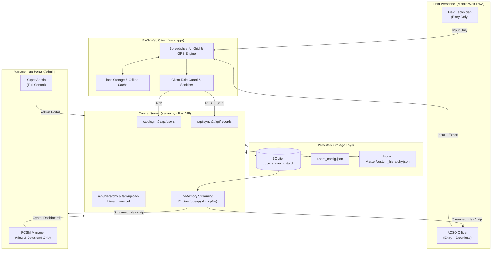

# GPON Network Mapping & Survey Platform
## Comprehensive Engineering Specification & Architecture Textbook

---

# Chapter 1: Executive Summary & Project Genesis

### 1.1 Problem Statement & Industrial Context
In high-density Fiber-to-the-Home (FTTH) and Gigabit Passive Optical Network (GPON) deployments—specifically within telecommunications infrastructures across Kerala—field surveying and physical plant mapping represent critical operational bottlenecks. Field surveyors and technicians must accurately audit fiber distribution enclosures (FDUs/FATs), optical splitters, customer drops, KSEB (Kerala State Electricity Board) utility pole positions, RT (Remote Terminal) rooms, and Optical Line Terminal (OLT) node connections.

Historically, this data was captured through disjointed manual spreadsheets, field paper logs, or desktop-only forms. This caused severe operational friction:
1. **Lookahead Inconsistencies & Casing Duplication**: Variations in data entry (e.g., `Thrissur North` vs `THRISSUR NORTH`, or typos like `Thathamangalm`) corrupted databases and prevented reliable spatial queries.
2. **Offline Data Loss**: Field surveyors frequently operate in remote, low-connectivity, or subterranean RF shadow zones where cloud-dependent forms fail.
3. **Storage Bloat & Concurrency Hazards**: Storing static spreadsheets per center on a server disk resulted in file locks, disk bloat, sync collisions, and data drift during updates.
4. **Unregulated Data Access**: Field contractors could download proprietary network subscriber metrics, while regional managers lacked dedicated, read-only analytics dashboards.

### 1.2 Evolutionary Milestones of the Project
To address these challenges, the platform underwent a rigorous, multi-phase architectural evolution:
* **Phase I (Offline-First Spreadsheet PWA)**: Creation of a responsive, mobile-optimized progressive web app (`web_app/`) mimicking a fast spreadsheet grid with high-precision GPS auto-capture and standardized splitter color codes.
* **Phase II (Centralized SQLite & Persistence Engine)**: Construction of `server.py` using FastAPI and SQLite (`gpon_survey_data.db`), backed by an automated JSON synchronization layer (`users_config.json`) to prevent data loss during continuous git deployments.
* **Phase III (Node Master Hierarchy Engine)**: Development of a 4-level topological tree (`Region -> Center -> RT Room -> Node/OLT -> Port`) loaded dynamically via uploaded Excel workbooks into `Node Master/custom_hierarchy.json`.
* **Phase IV (In-Memory Streaming Architecture)**: Complete elimination of static server-side `.xlsx` files. All spreadsheets and ZIP archives are generated on-the-fly in RAM (`io.BytesIO`) directly from the SQLite database.
* **Phase V (4-Tier Role-Based Access Control - RBAC)**: Enforcement of 4 distinct user tiers (`super_admin`, `rcsm`, `acso`, `field_technician`), decoupling administrative privileges from geographical center assignments.
* **Phase VI (Dynamic Dropdown Harmonization)**: Elimination of all legacy hardcoded strings, ensuring all UI selectors in `/admin` and `web_app/` dynamically reflect the active Node Master hierarchy.

---

# Chapter 2: High-Level System Architecture & Component Wiring

### 2.1 Architectural Blueprint
The system follows a decoupled Client-Server architecture designed for resilience against network degradation:



### 2.2 Component Communications & Data Protocols
* **Client to Server**: All transaction exchanges use HTTP/1.1 or HTTP/2 JSON over TLS. Payloads include client-generated UUID4 strings for idempotent deduplication.
* **Master Hierarchy Ingestion**: Uploaded via `multipart/form-data`, validated in-memory by `openpyxl`, and serialized into `custom_hierarchy.json`.
* **Export Delivery**: Excel workbooks and multi-region ZIP archives are assembled directly in server memory using `io.BytesIO` streams with MIME types `application/vnd.openxmlformats-officedocument.spreadsheetml.sheet` and `application/zip`, preventing disk writes entirely.

---

# Chapter 3: Data Model, Database Schema & State Management

### 3.1 SQLite Relational Schema (`gpon_survey_data.db`)

#### 1. Table `survey_records`
Stores every mapped field enclosure, optical connection, and subscriber link:

```sql
CREATE TABLE IF NOT EXISTS survey_records (
    client_uuid TEXT PRIMARY KEY,
    enclosure_id TEXT,
    region TEXT DEFAULT 'Thrissur',
    center TEXT,
    rt_room TEXT,
    olt_name TEXT,
    port_number TEXT,
    kseb_post_number TEXT,
    landmark TEXT,
    lat_long TEXT,
    customers_connected INTEGER,
    splitter_lead_color TEXT,
    adl_subscriber_id TEXT,
    acs_subscriber_id TEXT,
    surveyor_name TEXT,
    surveyor_username TEXT,
    survey_date_time TEXT,
    synced_at TEXT,
    raw_payload TEXT
);
```

#### 2. Table `users`
Enforces identity, credentials, geographical boundaries, and the 4 canonical roles:

```sql
CREATE TABLE IF NOT EXISTS users (
    username TEXT PRIMARY KEY,
    password TEXT NOT NULL,
    full_name TEXT NOT NULL,
    assigned_center TEXT NOT NULL,
    assigned_region TEXT DEFAULT 'Thrissur',
    role TEXT DEFAULT 'field_technician',
    created_at TEXT
);
```

#### 3. Table `app_config`
Key-value configuration store for runtime application settings:

```sql
CREATE TABLE IF NOT EXISTS app_config (
    key TEXT PRIMARY KEY,
    value TEXT
);
```

### 3.2 Dual-State Persistence Pattern (`users_config.json`)
To ensure continuous integration and remote Linux deployment safety:
* **The Vulnerability**: Standard SQLite databases can be corrupted, overwritten, or cleared during git branch operations or accidental deletions.
* **The Invariant Solution**: `server.py` implements a two-way synchronization loop with `users_config.json`.
  * `save_users_to_json(conn)`: Serializes current SQLite user table contents to `users_config.json` on any user creation or edit.
  * `load_users_from_json(conn)`: Executed during `init_db()`. If the SQLite database is re-initialized or cloned, it restores all accounts, roles, and credentials from `users_config.json`.

---

# Chapter 4: The Network Hierarchy Engine (Node Master)

### 4.1 Topology Tree Structure
GPON fiber networks depend on strict hierarchical containment. The platform models this as an indexed JSON structure:

```
[Region] (e.g. Thrissur)
  └── [Center] (e.g. CHALAKKUDY)
        └── [RT Room] (e.g. Potta)
              └── [Node / OLT Name] (e.g. CKY/116/OLT 01/Potta-1)
                    ├── Technology: GPON | FTTH | WDM | EDFA
                    ├── OLT Type: 8 P | 16 P | 32 P
                    └── Ports: ["P1", "P2", ..., "P8"]
```

### 4.2 Excel Ingestion & Serialization Pipeline
The `/api/upload-hierarchy-excel` endpoint parses heterogeneous Excel spreadsheets using fuzzy column matching:

```python
# Column Normalization Matrix
column_aliases = {
    'Region': ['region', 'district', 'zone', 'circle'],
    'Center': ['center', 'exchange', 'area', 'central office', 'co'],
    'RT Room': ['rt room', 'rt_room', 'rtroom', 'rt', 'sub center', 'location'],
    'Tech': ['gpon/ftth/wdm', 'technology', 'tech', 'system'],
    'Node': ['olt/node name', 'node name', 'olt name', 'node', 'olt', 'device ip'],
    'Ports': ['olt type', 'ports', 'number of ports', 'capacity']
}
```

* **Deduplication Invariant**: Spaces and case are trimmed. Existing node configurations are merged without overwriting historical survey records.
* **JSON Target**: Persisted directly to `Node Master/custom_hierarchy.json`.

---

# Chapter 5: Dynamic In-Memory Streaming & Zero-Disk Storage Architecture

### 5.1 The Zero-Disk Paradigm
Traditional file management writes `.xlsx` spreadsheets to physical folders (e.g., `data/Thrissur/CHALAKKUDY/survey.xlsx`). This causes severe concurrency problems when multiple surveyors sync simultaneously.

The platform eliminates disk storage:
1. **Single Source of Truth**: All survey records live solely inside the SQLite database.
2. **RAM Generation**: When an administrator or surveyor requests an Excel download, Python's `openpyxl` compiles the spreadsheet directly inside a memory stream (`io.BytesIO()`).
3. **Garbage Collection**: Once the bytes are transferred via HTTP, the memory buffer closes, leaving zero residue on the server disk.

### 5.2 Dynamic Export Endpoints

#### 1. Full Master Excel Export (`GET /api/export-excel`)
Generates an institutional spreadsheet containing all database records across all regions with standardized formatting, column auto-sizing, and fill headers.

#### 2. Center-Specific Excel Export (`GET /api/export-center-excel?center=...&region=...`)
Filters SQLite records by the exact Center and Region query parameters and streams a center-specific `.xlsx` workbook on the fly:

```python
@app.get("/api/export-center-excel")
def export_center_excel(center: str, region: Optional[str] = "Thrissur"):
    conn = sqlite3.connect(DB_PATH)
    cur = conn.cursor()
    cur.execute("SELECT ... FROM survey_records WHERE LOWER(TRIM(center)) = LOWER(TRIM(?))", (center,))
    rows = cur.fetchall()
    conn.close()

    wb = openpyxl.Workbook()
    # Populate rows, format styles ...
    buffer = io.BytesIO()
    wb.save(buffer)
    buffer.seek(0)
    return StreamingResponse(buffer, media_type="application/vnd.openxmlformats-officedocument.spreadsheetml.sheet", ...)
```

#### 3. Hierarchical In-Memory ZIP Archive (`GET /api/export-data-zip`)
Constructs an entire virtual multi-region folder structure completely within memory:

```python
@app.get("/api/export-data-zip")
def export_all_data_zip():
    # 1. Query all distinct regions and centers
    # 2. Open in-memory zip container: zipfile.ZipFile(in_memory_zip, "w")
    # 3. For each center: generate center workbook in RAM, stream into zip:
    #    zip_file.writestr(f"data/{region_clean}/{center_clean}/{excel_filename}", center_buffer.getvalue())
    # 4. Stream compiled ZIP container directly to HTTP client
```

---

# Chapter 6: 4-Tier Role-Based Access Control (RBAC)

### 6.1 Role Authority Matrix

The system enforces 4 non-overlapping operational roles:

| Role Identifier | Role Label | Scope & Permissions | Mobile Web App (`/`) | Admin Portal (`/admin`) |
| :--- | :--- | :--- | :--- | :--- |
| `super_admin` | **Super Admin** | Full root authority over all systems, nodes, users, databases, imports, and exports. | Full Access | Full Access (All 4 Tabs active) |
| `rcsm` | **RCSM** (Regional / Center Survey Manager) | View-only executive dashboard. Can monitor real-time survey feeds and download center/region data. **No data entry**. | **View-Only Mode**: Form disabled, inputs locked, submit button hidden. | **Dashboard Access**: Tabs 1 & 4 active. Tabs 2 & 3 hidden. |
| `acso` | **ACSO** (Area / Center Survey Officer) | Senior field officer. Enters field survey data and can export local Excel/CSV reports. | **Full Entry + Export**: Form active, submit active, export buttons visible. | **Restricted**: Redirected to mobile survey app. |
| `field_technician` | **Field Technician** | Frontline technician. Captures survey records in the field. **No download permissions**. | **Entry Only**: Form active, submit active, **export buttons completely hidden**. | **Restricted**: Redirected to mobile survey app. |

### 6.2 Decoupling Roles from Geographical Center Assignments
* **The Principle**: A user's functional rights are determined **strictly by their `role` attribute**, completely decoupled from their `assigned_center`.
* **Behavioral Examples**:
  * An `RCSM` assigned to `THRISSUR NORTH` can view and download data for Thrissur North, but cannot enter survey records.
  * A `super_admin` assigned to `THRISSUR NORTH` retains root administrative permissions across all tabs.
  * A `field_technician` assigned to `ALL` can record surveys for any center, but remains blocked from downloading datasets.

### 6.3 Multi-Region & Multi-Center Assignment (ACSO Multi-Center Charge)
* **The Operational Requirement**: Senior field officers such as ACSOs often oversee multiple network centers across one or more regions (e.g., an ACSO managing both `CHALAKKUDY` and `KODUNGALLUR`).
* **Admin Portal Assignment (`/admin` Tab 2)**:
  * Replaced static single-select dropdowns with dynamic, searchable checklist dropdown panels for both **Regions** and **Centers**.
  * Quick-action toggles: "Select All" and "Clear" allow rapid assignment.
  * Real-time badges: An active `#selected-centers-tags-bar` displays removable tag chips for every selected center.
  * Persistence: Multiple centers are stored as canonical comma-separated strings (e.g., `"CHALAKKUDY, KODUNGALLUR"`) in the SQLite database and `users_config.json` backup file. The backend API dynamically delivers both string and parsed array formats (`assigned_centers` and `assigned_regions`).
* **Field Portal Dynamic Switching (`web_app/app.js`)**:
  * **Single-Center Users (e.g. Field Technicians)**: If a user is assigned exactly one center, `#center-select` remains securely locked (`disabled = true`) to prevent accidental misallocation of survey entries.
  * **Multi-Center Users (e.g. Multi-Charge ACSOs)**: When a user has multiple assigned centers, `#center-select` is automatically **unlocked** (`disabled = false`) and populated exclusively with the centers under their jurisdiction. Selecting any center dynamically cascades down to filter the corresponding RT rooms, OLT devices, and regional parameters.
  * **Global Users (`ALL` / Super Admin)**: Unrestricted access to all network centers across the hierarchy.
  * **User Ribbon**: Displays `Charge of N Centers` badge when multiple centers are assigned.

### 6.4 Registered Email Address & Automated OTP Password Recovery
* **Operational Need**: Field technicians and ACSOs operating in remote terrain need the capability to reset or change their password/PIN securely without administrative bottlenecks.
* **Two-Step Email OTP Architecture**:
  * **Step 1 (OTP Generation & Dispatch)**:
    * Endpoint: `POST /api/request-password-reset-otp` accepting `username_or_email`.
    * System locates user in SQLite, generates a random 6-digit numeric OTP (`f"{random.randint(100000, 999999)}"`), caches it in-memory with a 10-minute expiry (`OTP_EXPIRY_SECONDS = 600`), and dispatches an HTML email via SMTP.
    * Privacy masking: The client receives a masked email address (e.g. `j***n@bsnl.co.in`) for confirmation.
  * **Step 2 (OTP Verification & Credential Update)**:
    * Endpoint: `POST /api/verify-password-reset-otp` accepting `username`, `otp`, and `new_password`.
    * Verifies code, expiry, and enforces a brute-force circuit breaker (maximum 5 failed attempts before OTP invalidation).
    * Upon successful validation, commits the new password to SQLite `users` and serializes to `users_config.json`.
* **SMTP Server Configuration (`.env`)**:
  * The server automatically parses `/home/psms/Network-Mapping/.env` with standard environment variables:
    ```bash
    SMTP_HOST=smtp.gmail.com
    SMTP_PORT=587
    SMTP_USER=your_email@gmail.com
    SMTP_PASSWORD=your_app_password
    SMTP_FROM=your_email@gmail.com
    SMTP_TLS=true
    ```
  * **Zero-Crash Fallback**: If SMTP credentials are not yet configured, the system logs the 6-digit OTP directly to the systemd server console (`journalctl -u gpon-server`) so testing and administrative verification are completely seamless.
* **Client Interface**:
  * **Field App (`web_app/`)**: The login overlay features *"🔑 Forgot / Change PIN or Password?"* and the top ribbon provides a *"🔑 Change PIN"* shortcut opening a modern 2-step OTP modal with a 60-second resend cooldown timer.
  * **Admin Portal (`/admin`)**: Users table includes an **Email Address** column and the user modal captures registered emails during account provisioning.

---

# Chapter 7: Field Mobile Web Application (Client-Side Architecture)

### 7.1 Progressive Web App Mechanics (`web_app/`)
* **`index.html`**: Semantic layout structuring the user ribbon, active row input card, splitter color pickers, and live spreadsheet preview table.
* **`style.css`**: Professional desktop/mobile spreadsheet design imitating Google Sheets, with high-contrast color badges and accessible touch targets.
* **`app.js`**: Core client engine managing offline storage, GPS polling, UI permission switching, and background server synchronization.
* **`preload_data.js`**: Bundled fallback data ensuring the field app can execute completely offline even on initial launch before connecting to the server.

### 7.2 Optical Splitter Lead Color Code Engine
The platform includes built-in telecommunications color sequencing:

```javascript
const COLOR_CODES_BY_RATIO = {
  "1:8": ["Blue", "Orange", "Green", "Brown", "Slate", "White", "Red", "Black"],
  "1:4": ["Blue", "Orange", "Green", "Brown"],
  "1:2": ["Blue", "Orange"],
  "1:16": ["Blue", "Orange", "Green", "Brown", "Slate", "White", "Red", "Black",
          "Yellow", "Violet", "Rose", "Aqua", "Olive", "Magenta", "Tan", "Lime"]
};
```

### 7.3 High-Precision Geolocation Polling (Strict On-Demand Triggering)
GPS coordinate acquisition is strictly **on-demand** upon clicking the `[📍 GPS]` button (or map recenter target). The system intentionally **does not** query GPS automatically on page load or refresh, preventing battery drain, unwanted coordinate overrides, and device permission prompts when simply reviewing records.

When triggered, `app.js` runs a multi-sample satellite convergence loop with high accuracy:

```javascript
navigator.geolocation.getCurrentPosition(
  (pos) => {
    const lat = pos.coords.latitude.toFixed(6);
    const lng = pos.coords.longitude.toFixed(6);
    latLongInput.value = `${lat}, ${lng}`;
  },
  (err) => { console.warn("GPS unavailable, manual entry enabled."); },
  { enableHighAccuracy: true, timeout: 8000, maximumAge: 0 }
);
```

### 7.4 Real-Time Server Connectivity & Synchronization States
The top-left header of the PWA displays an interactive status indicator directly reflecting live connectivity with the Ubuntu server (`/api/health`):

| Status Indicator Text | Dot Color | System State & Meaning |
| :--- | :--- | :--- |
| `Checking server...` | Amber (`#f59e0b`) | Initial ping / handshake on startup or reconnection. |
| `Server Connected (Synced ✓)` | Emerald Green (`#10b981`) | Server reachable and all local records are saved to SQLite. |
| `Server Connected (N unsynced)`| Blue (`#0284c7`) | Server reachable; N newly surveyed records are queued to upload. |
| `Syncing with Server...` | Sky Blue (`#38bdf8`) | Active background HTTP payload upload in progress. |
| `Server Disconnected (Offline)` | Red (`#ef4444`) | Server unreachable; all records safely preserved on device. |

* **Interactive Tap-to-Sync**: Field surveyors can tap the status text at any time to immediately test server reachability and trigger a manual sync (`triggerManualSync()`).

### 7.5 Smart Battery-Efficient Heartbeat Engine (Zero Server Load)
To verify live connectivity across dozens of concurrent field technicians without degrading server performance or draining phone batteries, the platform implements an optimized heartbeat protocol:
1. **In-Memory Health Probe (`/api/health`)**: The endpoint executes 0 database queries on SQLite. It returns a tiny ~80-byte JSON payload (`{"status":"ok", "hierarchy_version": <mtime>, "server_time": ...}`) responding in under 0.1ms.
2. **Conditional Network Downloads**: The client only downloads the node hierarchy tree (`/api/hierarchy`) when `hierarchy_version` has actually updated on the server, eliminating repetitive downloads of network trees over mobile data.
3. **Screen-Off / Inactivity Throttling**: The 20-second heartbeat loop checks `document.visibilityState`. When a surveyor locks their phone screen or switches apps, the timer automatically pauses, consuming 0% battery and 0 server bandwidth.
4. **Instant Foreground Wake**: When the surveyor opens their phone or switches back to the browser tab (`visibilitychange` -> `visible`), an immediate health probe fires, restoring the green connected indicator instantly.

---

# Chapter 8: Central Office Web Portal (`/admin`)

### 8.1 Single-Page Architecture
The central office dashboard is served by `admin_dashboard()` in `server.py` as a single-page management application with zero external framework dependencies.

### 8.2 Operational Tabs

```mermaid
graph TD
    AdminPortal["Central Office Portal (/admin)"]
    AdminPortal --> Tab1["Tab 1: 📋 Survey Feed & Center Dashboard"]
    AdminPortal --> Tab2["Tab 2: 👥 User Access Management (4 Tiers)"]
    AdminPortal --> Tab3["Tab 3: 📡 Upload Node Master Data"]
    AdminPortal --> Tab4["Tab 4: 📁 Dynamic Region & Center Folders"]

    Tab1 --> T1_1["Region & Center Filter Bars"]
    Tab1 --> T1_2["Live Counters (Records, Customers, Enclosures)"]
    Tab1 --> T1_3["Download Center Excel"]

    Tab2 --> T2_1["Add User Button & Pop-Up Modal Window"]
    Tab2 --> T2_2["Email Address Column & Account Management"]
    Tab2 --> T2_3["Dynamic Multi-Region & Multi-Center Selectors"]
    Tab2 --> T2_4["Backup & Restore users_config.json"]

    Tab3 --> T3_1["Upload Master Excel (.xlsx)"]
    Tab3 --> T3_2["Add / Edit Node Modal"]
    Tab3 --> T3_3["Bulk Checkbox Deletion"]

    Tab4 --> T4_1["All Centers ZIP Export"]
    Tab4 --> T4_2["Per-Center On-Demand Excel Downloads"]
    Tab4 --> T4_3["Storage Optimizer & Recount"]
```



---

# Chapter 9: Complete API Reference & Wiring Directory

### 9.1 Server Endpoint Catalog

| Endpoint | Method | Security / Role | Purpose |
| :--- | :--- | :--- | :--- |
| `/api/login` | `POST` | Public | Authenticates credentials; returns normalized user profile and role. |
| `/api/change-password` | `POST` | Public (Email verified) | Updates password/PIN after validating registered email address. |
| `/api/users` | `GET` | Super Admin | Returns list of all active users, assigned regions, centers, and roles. |
| `/api/users` | `POST` | Super Admin | Upserts a user with defined credentials, center, and role; updates JSON backup. |
| `/api/users/{username}` | `DELETE` | Super Admin | Permanently deletes a user account; persists deletion to JSON backup. |
| `/api/config/users` | `GET` | Super Admin | Downloads raw `users_config.json` backup file. |
| `/api/config/users` | `POST` | Super Admin | Restores user accounts from an uploaded JSON configuration file. |
| `/api/hierarchy` | `GET` | All Roles | Returns active network topological tree (`custom_hierarchy.json`). |
| `/api/hierarchy/olt` | `POST` | Super Admin | Adds or updates a single node in the hierarchy. |
| `/api/hierarchy/olt` | `DELETE` | Super Admin | Deletes a single node from the hierarchy. |
| `/api/hierarchy/bulk-delete` | `POST` | Super Admin | Deletes multiple checked nodes simultaneously. |
| `/api/upload-hierarchy-excel`| `POST` | Super Admin | Parses and merges an uploaded master hierarchy Excel workbook. |
| `/api/download-hierarchy-template` | `GET` | Super Admin | Streams a formatted Excel template for bulk node uploads. |
| `/api/records` | `GET` | Super Admin, RCSM | Retrieves survey records with optional `center` and `region` query filters. |
| `/api/records/{uuid}` | `DELETE` | Super Admin | Deletes an invalid or duplicate survey record from the database. |
| `/api/sync` | `POST` | ACSO, Field Tech | Ingests batched offline survey records from field devices. |
| `/api/export-excel` | `GET` | Super Admin, RCSM | Streams the full master survey dataset as an `.xlsx` file. |
| `/api/export-center-excel` | `GET` | Super Admin, RCSM | Streams a filtered `.xlsx` spreadsheet for a specific Center. |
| `/api/export-data-zip` | `GET` | Super Admin, RCSM | Streams a dynamic ZIP archive containing organized spreadsheets for all centers. |
| `/api/data-folders-summary` | `GET` | Super Admin, RCSM | Returns region and center metrics without creating disk files. |
| `/api/resync-data-folders` | `POST` | Super Admin | Cleans up legacy disk spreadsheets and recounts active records. |

---

# Chapter 10: Production Deployment, Operations & Resilience Guide

### 10.1 Linux Server Setup (Ubuntu 22.04 / 24.04 LTS)

* **Production Root Directory**: `/home/psms/Network-Mapping`

#### 1. Clone & Setup Environment
```bash
cd /home/psms
git clone https://github.com/teckscribe/Network-Mapping.git
cd /home/psms/Network-Mapping
python3 -m venv venv
source venv/bin/activate
pip install --upgrade pip
pip install fastapi uvicorn openpyxl pydantic python-multipart
```

#### 2. Systemd Daemon Configuration
Create service definition at `/etc/systemd/system/gpon-server.service`:

```ini
[Unit]
Description=GPON Network Mapping Central Server
After=network.target

[Service]
Type=simple
User=psms
WorkingDirectory=/home/psms/Network-Mapping
ExecStart=/home/psms/Network-Mapping/venv/bin/uvicorn server:app --host 0.0.0.0 --port 9001 --workers 2
Restart=always
RestartSec=3
Environment="PYTHONUNBUFFERED=1"

[Install]
WantedBy=multi-user.target
```

Enable and start the service:
```bash
sudo systemctl daemon-reload
sudo systemctl enable gpon-server
sudo systemctl start gpon-server
sudo systemctl status gpon-server
```

### 10.2 Maintenance & Zero-Downtime Updates
Whenever changes are pushed to GitHub:
```bash
cd /home/psms/Network-Mapping
git pull origin main
sudo systemctl restart gpon-server
```
Because user profiles and network hierarchies are stored in persistent SQLite and JSON configurations, software updates will never overwrite existing surveyor accounts or active survey datasets.
