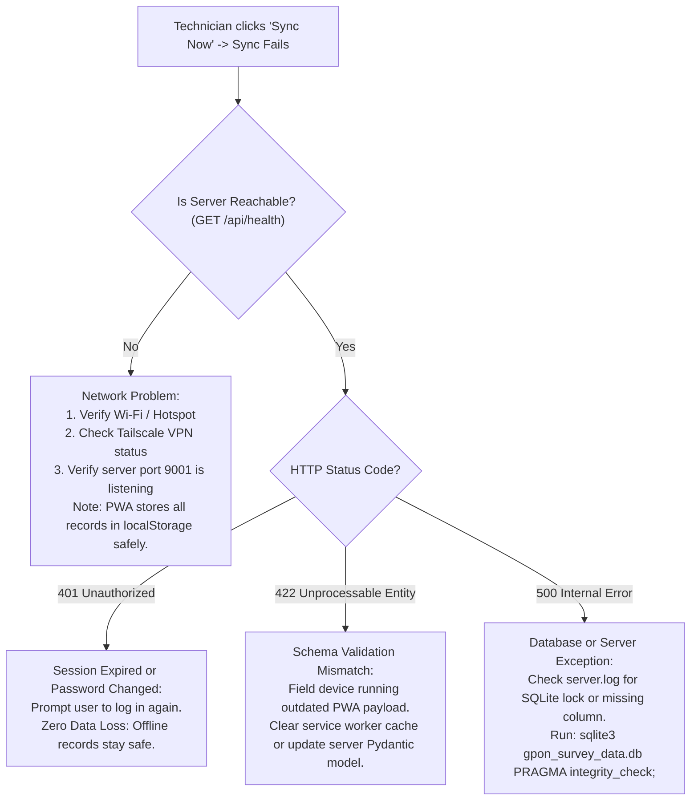

# Troubleshooting Runbook & Fault Tree Analysis
*Generated automatically on: 2026-10-10 17:20:35*

## 1. Fault Tree: Field Technician Cannot Sync


## 2. Emergency Recovery Runbooks

### Runbook 1: Restoring Corrupted SQLite Database
If `server.py` logs `database disk image is malformed`:
```bash
# Dump and rebuild SQLite database
sqlite3 gpon_survey_data.db ".dump" | sqlite3 gpon_survey_data_repaired.db
mv gpon_survey_data.db gpon_survey_data_corrupt_backup.db
mv gpon_survey_data_repaired.db gpon_survey_data.db
sudo systemctl restart gpon-server.service
```

### Runbook 2: Recovering User Credentials from `users_config.json`
If user table is emptied accidentally:
1. Stop server: `sudo systemctl stop gpon-server.service`
2. Ensure `users_config.json` contains valid credentials.
3. Start server: `sudo systemctl start gpon-server.service`
4. The server's `init_db()` automatically restores all users into SQLite.

### Runbook 3: Force Refresh Field Technician PWA Cache
If a technician's mobile browser is stuck on an old version of `app.js`:
1. In Chrome / Samsung Internet, tap the three dots -> **Settings** -> **Site settings** -> **All sites**.
2. Find the survey domain (e.g., `network-mapping.online` or local IP).
3. Tap **Clear & reset**.
4. Re-open app and log in.
